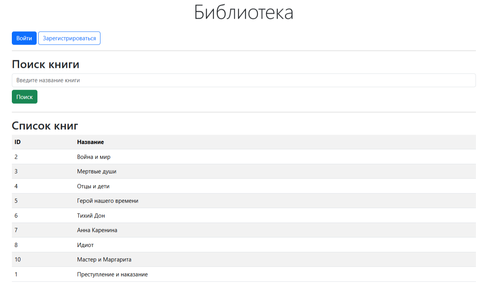
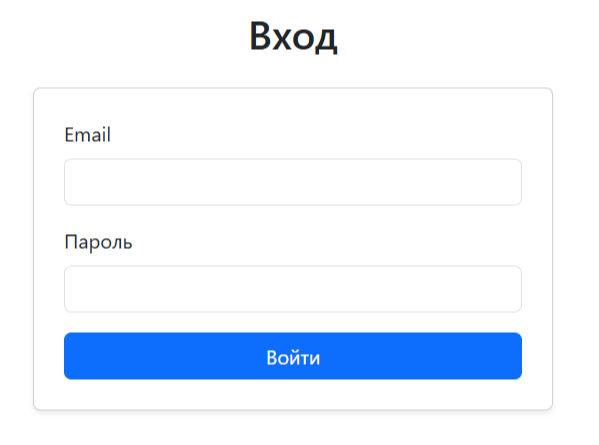
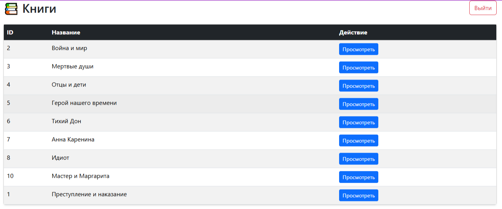
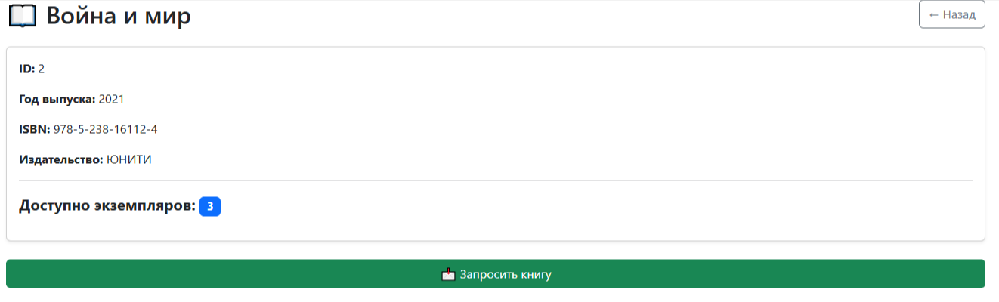
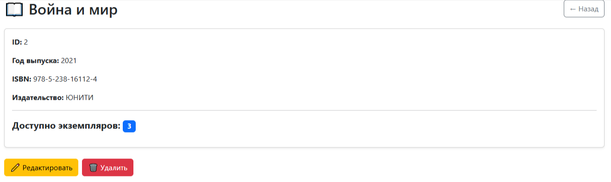
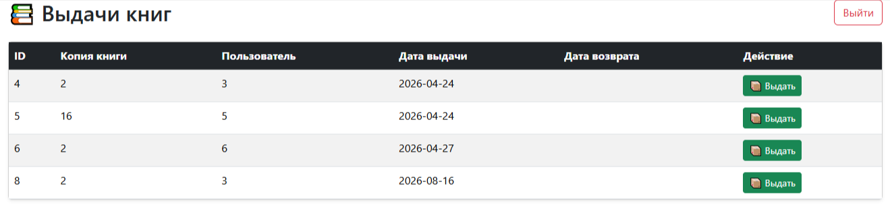

Library Management System

Library Management System is a Java web application for managing books, users and library operations. A learning project built with Java Servlets, JSP, PostgreSQL and JDBC.
The application implements user authentication, book management and library operations with a layered architecture.

## Features

- User registration and authentication
- User authorization and role-based access
- Book management
- Book search and filtering
- User management
- Validation of user input
- Logging of application events

  ## Tech Stack

- **Java 17**
- **Maven**
- **Java Servlets**
- **JSP**
- **JSTL**
- **Bootstrap**
- **JDBC**
- **PostgreSQL**
- **Log4j2**
- **jBCrypt**
- **Apache Tomcat**

  ## Architecture

The application follows a layered architecture that separates business logic, data access, and request handling.

The main layers are:

- **Controller** — handles HTTP requests and responses and communicates with the service layer.
- **Service** — contains the application's business logic and coordinates operations between controllers and DAOs.
- **DAO** — responsible for communication with the PostgreSQL database.
- **Model** — contains entities and data objects used by the application.

The Factory Pattern is used to encapsulate object creation and reduce coupling between application components.

The general request flow is:

Controller → Service → DAO → PostgreSQL

## Project Structure

```text
src
└── main
    ├── java
    │   └── com.my_library
    │       ├── controller
    │       └── database
    │           ├── connection
    │           └── dao
    │       ├── exception
    │       ├── filter
    │       ├── model
    │       ├── service
    │       ├── util
    │       └── validator
    │
    ├── resources
    │
    └── webapp
        ├── jsp
        └── WEB-INF
```

## Database

The application uses PostgreSQL as the relational database.
JDBC is used to establish database connections and execute SQL queries.
The database contains tables for storing information about users, books, and library operations.

### Database Schema


## Authentication and Security

The application provides user authentication.
Passwords are not stored in plain text. BCrypt is used for password hashing before storing credentials in the database.
The application also implements role-based access control for different types of users.

## How to Run

### Prerequisites

- Java 17+
- Maven
- PostgreSQL
- Apache Tomcat

  ### 1. Clone the repository

```bash
git clone https://github.com/ElenaV-dev/Library-Project.git
cd Library-Project
```
 ### 2. Create the database

Create a PostgreSQL database named test_db.

 ### 3. Create database tables

Execute the scriptsCreateTables.sql script against the test_db database.

 ### 4. Insert test data

To populate the database with sample data, execute the provided scriptsFillTales.sql for inserting data.

 ### 5. Configure the database connection

The database connection is configured in ConnectionPool.properties.

 ### 6. Build the project

Run:

```bash
mvn clean package
```
After a successful build, the my-app.war will be generated in the target directory.

 ### 7. Deploy the application

Copy my-app.war to the webapps directory of Apache Tomcat.

 ### 8. Start Tomcat

Start the Apache Tomcat server.

 ### 9. Open the application

Open the following URL in your browser:

http://localhost:8080/my-app

## Screenshots

### Main page



### Login



### Books



### Book



### Admin page 



### Librarian page



## What I Learned

While developing this project, I practiced:

- Building Java web applications using Servlets and JSP
- Working with PostgreSQL through JDBC
- Applying the DAO and Service layer patterns
- Separating application responsibilities into different layers
- Implementing user authentication
- Working with password hashing using BCrypt
- Using Maven for dependency management and project builds
- Implementing application logging with Log4j2
- Deploying a WAR application to Apache Tomcat
