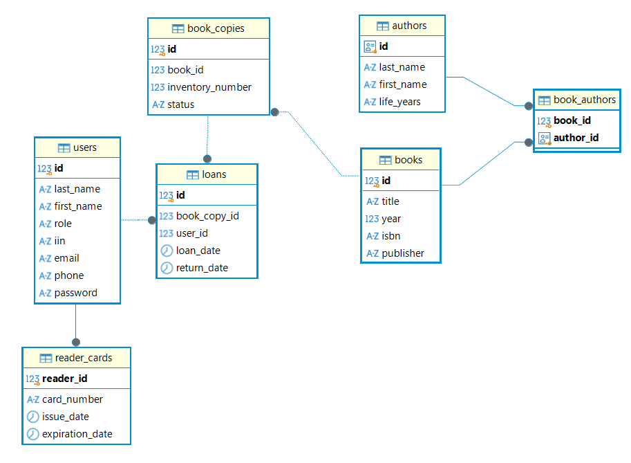

Library Management System

Library Management System is a Java web application for managing books, users and library operations. A learning project built with Java Servlets, JSP, PostgreSQL and JDBC.
The application implements user authentication, book management and library operations with a layered architecture.

## Features

- User registration and authentication
- User authorization and role-based access
- Book management
- Book search and filtering
- User management
- Validation of user input
- Logging of application events

  ## Tech Stack

- **Java 17**
- **Maven**
- **Java Servlets**
- **JSP**
- **JSTL**
- **JDBC**
- **PostgreSQL**
- **Log4j2**
- **jBCrypt**
- **Apache Tomcat**

  ## Architecture

The application follows a layered architecture that separates business logic, data access, and request handling.

The main layers are:

- **Controller** — handles HTTP requests and responses and communicates with the service layer.
- **Service** — contains the application's business logic and coordinates operations between controllers and DAOs.
- **DAO** — responsible for communication with the PostgreSQL database.
- **Model** — contains entities and data objects used by the application.

The general request flow is:

Controller → Service → DAO → PostgreSQL

## Project Structure

```text
src
└── main
    ├── java
    │   └── com.my_library
    │       ├── controller
    │       └── database
    │           ├── connection
    │           └── dao
    │       ├── exception
    │       ├── filter
    │       ├── model
    │       ├── service
    │       ├── util
    │       └── validator
    │
    ├── resources
    │
    └── webapp
        ├── jsp
        └── WEB-INF
```

## Database

The application uses PostgreSQL as the relational database.
JDBC is used to establish database connections and execute SQL queries.
The database contains tables for storing information about users, books, and library operations.

### Database Schema



## Authentication and Security

The application provides user authentication.
Passwords are not stored in plain text. BCrypt is used for password hashing before storing credentials in the database.
The application also implements role-based access control for different types of users.

## How to Run

### Prerequisites

- Java 17+
- Maven
- PostgreSQL
- Apache Tomcat

  ### 1. Clone the repository

```bash
git clone https://github.com/ElenaV-dev/Library-Project.git
cd Library-Project
```

### Database Setup

1. Create a PostgreSQL database.
2. Configure the database connection in the application configuration.
3. Execute the required SQL scripts.

### Application Setup

1. Clone the repository.
2. Configure the database connection.
3. Build the project:

```bash
mvn clean package
```
4. Deploy the generated WAR file to Apache Tomcat.
5. Start the Tomcat server.
6. Open the application in a browser.

## Screenshots

### Login


### Books


## What I Learned

While developing this project, I practiced:

- Building Java web applications using Servlets and JSP
- Working with PostgreSQL through JDBC
- Applying the DAO and Service layer patterns
- Separating application responsibilities into different layers
- Implementing user authentication
- Working with password hashing using BCrypt
- Using Maven for dependency management and project builds
- Implementing application logging with Log4j2
- Deploying a WAR application to Apache Tomcat
